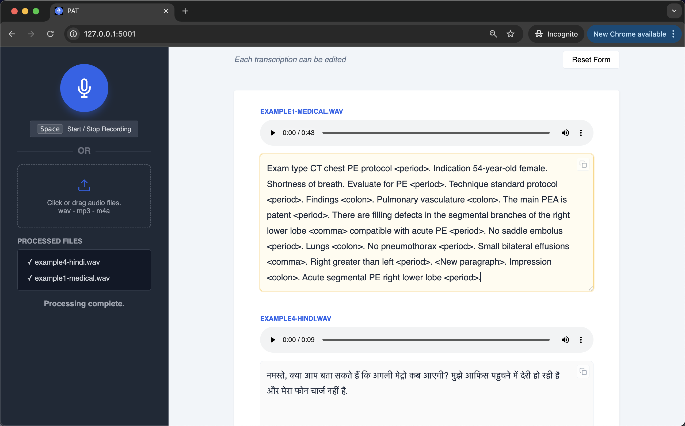

# Private Audio Transcriber (P-A-T)

- A lightweight, fully offline, multilingual dictation and transcription tool for Mac.
- Record audio in the app or drag and drop audio files.
- Your data never leaves your device.
- Powered by MLX-Whisper.

<br>

## This is particularly valuable for:

- <strong>Healthcare in multilingual communities</strong> - Doctors/nurses transcribing notes
- <strong>International business</strong> - Transcribing meetings, interviews, or calls in various languages
- <strong>Researchers</strong> - Transcribing field interviews across different languages
- <strong>Legal professionals</strong> - Handling cases involving non-English speakers
- <strong>Journalists</strong> - Working with sources who speak different languages
- Anyone concerned about privacy who doesn't want audio sent to cloud services

<br>


<p>Transcriptions are displayed with original audio for easier checking</p>

<br>


<br>

## Features

- <strong>Runs offline</strong>: No data leaves your device.
- <strong>Runs on mac</strong>: Supports MacOS only.
- <strong>Fast</strong>: Uses the Apple MLX framework.
- <strong>Supports batch transcriptions</strong>: Drag and drop your audio files.
- <strong>Limited AI use</strong>: Reduces frustration and delays caused by AI processing errors. 
- <strong>Self edit</strong>: Minimalist workflow. The system transcribes fast. You edit each transcription.
- <strong>Double-click a file to run</strong>: No command line needed for daily use.

<br>

## Security

- <strong>Local-Only Binding (Air-Gap Readiness)</strong><br>
   The application includes a check_host validation layer that forces the server to bind strictly to 127.0.0.1 or localhost. This prevents the app from being exposed to an external network or the public internet.

- <strong>Hardened Content Security Policy (CSP)</strong><br>
 A strict CSP header is enforced on every response, restricting resource loading to 'self'. It explicitly manages media-src for secure blob URL audio playback while preventing unauthorized cross-site scripting (XSS) vectors.

- <strong>Anti-Clickjacking Protection</strong><br>
  The app implements the X-Frame-Options: DENY header, ensuring the interface cannot be embedded in an iframe on a malicious site to trick users into interacting with the microphone.

- <strong>Custom Request Verification</strong><br>
  The /transcribe endpoint requires a specific custom header (X-Requested-With: MedicalApp). This acts as a basic CSRF (Cross-Site Request Forgery) defense by ensuring requests originate from your frontend and not a simple cross-origin form submission.

- <strong>Automated Temporary File Cleanup</strong><br>
  To protect patient privacy and data sovereignty, the app uses a finally block to ensure all uploaded audio files and converted .wav files are deleted from the local disk immediately after transcription, regardless of whether the process succeeded or failed.

- <strong>Error Masking & Detailed Logging</strong><br>
   The backend is configured to log detailed exception data to the server terminal while returning only generic, "safe" error messages to the client. This prevents "Information Leakage" where internal file paths or system configurations might be exposed to the user interface.

- <strong>Input Validation & Payload Limiting</strong><br>
  The server enforces a MAX_CONTENT_LENGTH of 100MB and performs strict file extension validation (.wav, .mp3, .m4a, .webm) to mitigate "Zip Bomb" style attacks or the execution of malicious scripts.

<br>

## How to Install and Run

<br>

In this section you will do the following:
- Install the uv Python package manager
- Install ffmeg
- Start the app by double clicking a file

<br>

```

--------------------------------------------------------------
System Requirements
--------------------------------------------------------------

Operating System: MacOS
Computer: Apple Silicon Mac (M Series)
RAM: 8GB
Free disk Space: 2 GB

--------------------------------------------------------------
Step-by-Step Setup
--------------------------------------------------------------

If you already have UV and ffmeg installed then please skip those steps.


1. Install ffmpeg
--------------------------------------------------------------

Use Hombrew (https://brew.sh/).

1. Open the terminal on your Mac
2. Paste in this line and press Enter:
brew install ffmpeg


2. Install UV
--------------------------------------------------------------

Paste this command into the terminal and press Enter:
wget -qO- https://astral.sh/uv/install.sh | sh


3. Download the project folder and place it on your desktop
--------------------------------------------------------------

On GitHub click on "<> Code". Then select "Download Zip"
Download the project folder and unzip it.
Inside the main folder you will find a folder named: Medical-Transcriber-v1.0
Place Medical-Transcriber-v1.0 on your desktop.

4. Install the App
--------------------------------------------------------------

1. cd into Medical-Transcriber-v1.0 folder:
cd Desktop
cd Medical-Transcriber-v1.0

7. Paste this command into the terminal and press Enter:
(This overwrites the file and changes the file permissions to make it executable.)
cat start-mac-app.command > temp && mv temp start-mac-app.command && chmod +x start-mac-app.command

8. Open the Medical-Transcriber-v1.0 folder

9. Double click this file: start-mac-app.command

10. The app will auto download all requirements and then open in your browser.
The first time you will need to wait a few seconds for the app to load. It will look like nothing is happening. Don't close the terminal.
Please ignore any escape related error messages.


--------------------------------------------------------------
Stopping the App
--------------------------------------------------------------

The app does not stop running when you close the browser tab.
To shut down the app, close the terminal window.
You can also close the terminal by selecting it and typing Ctrl+C on Mac.


--------------------------------------------------------------
Future startup
--------------------------------------------------------------

Now that the setup is complete, in future simply double-click the start-mac-app.command file to launch the app.
The project folder must be placed on your desktop before the app is launched.


```

<br>

## Simple Self Customization

This app can be used in many languages and in many domains - medical, legal etc. The code is simple. Someone with only a basic knowledge of Python (or an AI assistant) can modify the output text to suit a particular use case. Only the run_transcription function (below) needs to be modified in the ```app.py``` file.

```
def run_transcription(audio_path):
    """
    Transcribes audio using the mlx_whisper model and highlights dictation keywords.
    """
    result = mlx_whisper.transcribe(
        audio_path,
        # Make sure this points to your local model directory
        path_or_hf_repo="models/whisper-turbo-mlx"
    )

    text = result['text'].strip()
    language = result['language']
	
	
    if language == 'en':
	
	    # Keywords to be highlighted. This is case-insensitive.
	    dictation_keywords = [
	        'comma',
	        'period',
	        'colon',
	        'new paragraph',
	        'end of note'
	    ]
	
	    highlighted_text = text
	    for keyword in dictation_keywords:
	        # Use re.sub with a lambda function to wrap the found word
	        # while preserving its original casing (e.g., "Comma" becomes "<Comma>").
	        # Word boundaries (\b) ensure we don't highlight parts of other words.
	        pattern = r'\b(' + re.escape(keyword) + r')\b'
	        highlighted_text = re.sub(
	            pattern,
	            lambda match: f"<{match.group(1)}>",
	            highlighted_text,
	            flags=re.IGNORECASE
	        )
	
	    return highlighted_text
		
    else:
        return text

```

<br>

For example, you can add logic to fix errors that the transcriber routinely makes. Or, if the language is Spanish, you might want to highlight certain words in the text so they will be easier to see and quicker to edit.

```
elif language == 'es':
    dictation_keywords = ['coma', 'punto', 'nuevo párrafo']
    # ... apply same highlighting logic ...
```

<br>

## Whisper model can also be changed

This app uses the mlx-community/whisper-turbo model. You can change this to another mlx whisper model.
These are the available options:<br>
https://huggingface.co/collections/mlx-community/whisper

You will need to download it. Place it in the "models" folder, and change the model path in the code:

```
result = mlx_whisper.transcribe(
        audio_path,
        # Make sure this points to your local model directory
        path_or_hf_repo="models/whisper-turbo-mlx"
    )
```

Please keep in mind that the mlx-community/whisper-turbo model is auto downloaded during installation. Refer to the ```start-mac-app.command``` file.

<br>

## References

- mlx-community/whisper-turbo<br>
https://huggingface.co/mlx-community/whisper-turbo

- MLX-Whisper<br>
  https://github.com/ml-explore/mlx-examples/tree/main/whisper


<br>


## Revision History

Version 1.0<br>
14-Feb-2026<br>
Prototype. Released for testing.

<br>
